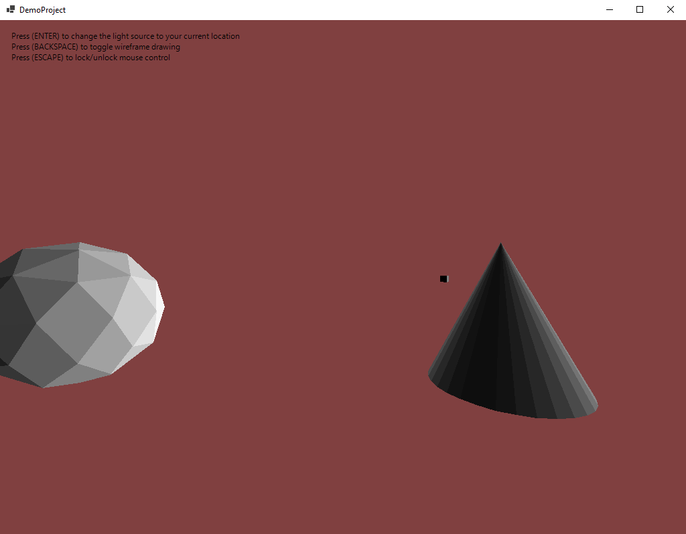
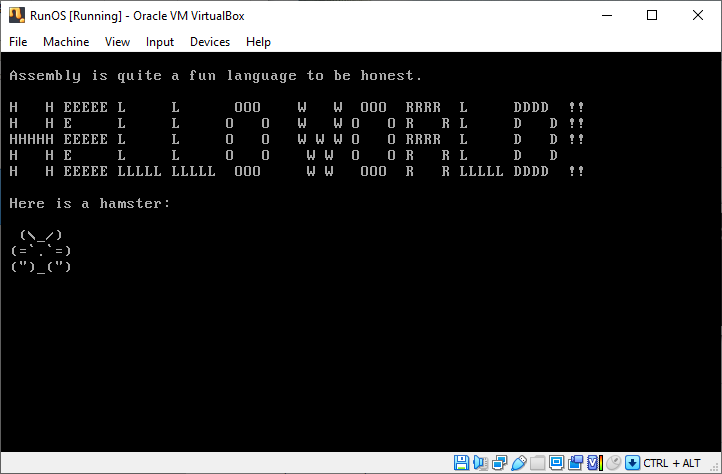
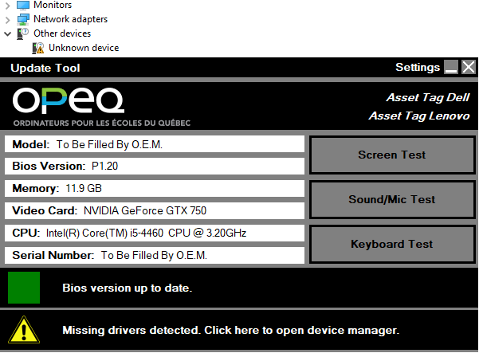

<!DOCTYPE HTML>

<html>
	<head>
		<title>LB_Portfolio</title>
		<meta charset="utf-8" />
		<meta name="viewport" content="width=device-width, initial-scale=1, user-scalable=no" />
		<link rel="stylesheet" href="assets/css/main.css" />
	</head>
	<body class="is-preload">

		<!-- Header -->
			

				

					<!-- Logo -->
						

							<h1 id="title">Loïc Baspeyre</h1>
							
Self-Taught Junior Developper

						

					<!-- Nav -->
						<nav id="nav">
							<ul>
								<li><a href="#about" id="about-link">About Me</a></li>
								<li><a href="#work" id="portfolio-link">My Work</a></li>
							</ul>
						</nav>

				

			

		<!-- Main -->
			

			
				<!-- About Me -->
					<section id="about" class="three">
						

							<header>
								<h2>About Me</h2>
							</header>						

							

							Passionate about technology in every aspect I studied in tech support along with some networking but quickly got hooked on programming.
							I love to learn on the inner workings of computers and software which is why I tend to "reinvent the wheel" a lot. It often leads to pretty intricate projects and challenges.						
							

						

					</section>

				<!-- My Work -->
					<section id="work" class="two">
						

							<header>
								<h2 style="font-family:Arial">My Work</h2>
							</header>

							
Here are some of the projects I made. Click on them for the Github repository.

							

								

									<article class="item">
										
										<header>
											<h3>
											    <a href="https://github.com/Repo-LB/GraphX3D" target="_blank" rel="noopener noreferrer"/>
											    GraphX3D (Graphics Engine)
										        </a>	
										    </h3>
										</header>
									</article>
								

								

									<article class="item">
										
										<header>
										    <h3>
										        <a href="https://github.com/Repo-LB/Assembly" target="_blank" rel="noopener noreferrer"/>
											    Bootable Text Editor
										        </a>	
											</h3>
										</header>
									</article>
								

								

									<article class="item">
										
										<header>
										    <h3>
										        <a href="#" onclick="alert('Sorry for the inconvenience.\n\nThis program was made exclusively for a company I previously worked for.\nI do not intend on publishing an exact copy the code. I might update it with a similar tool.');"/>
											    PC Repair Tool
										        </a>	
											</h3>
										</header>
									</article>
								

							

							
							  
							

							More projects to come ...
							

						

				    <!-- Contact -->
			

		<!-- Scripts -->
			
			
			
			
			
			
			

	</body>
</html>
